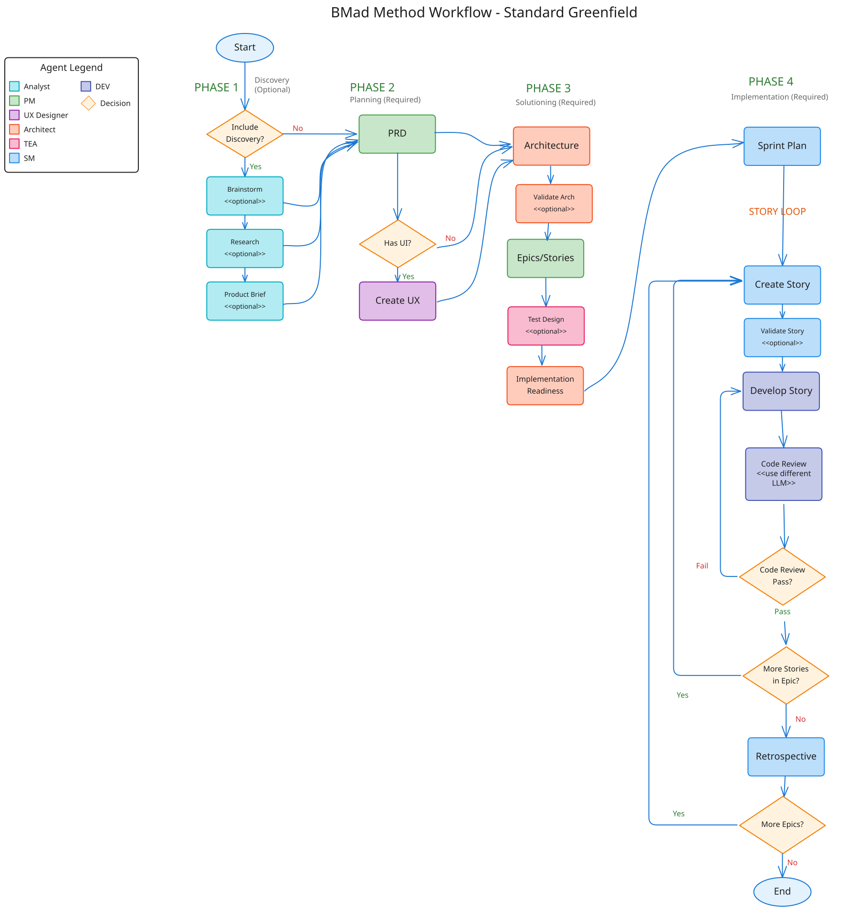

---
title: "BMad 方法入门指南"
description: "安装 BMad 并构建您的第一个项目"
---

**从旧版本升级？** 请参阅[升级指南](/docs/how-to/installation/upgrade-to-v6.md)。

---

通过专业智能体引导的 AI 驱动工作流，在规划、架构和实施阶段加速软件开发。

## 您将学习

- 为新项目安装并初始化 BMad 方法
- 根据项目规模选择合适的规划路径
- 从需求分析到可运行代码的完整流程
- 高效使用智能体和工作流

:::note[先决条件]
- **Node.js 20+** - 安装程序必需
- **Git** - 推荐用于版本控制
- **AI 驱动的 IDE** - Claude Code、Cursor、Windsurf 或类似工具
- **项目构思** - 即使是简单的想法也适合学习
:::

:::tip[快速路径]
**安装** → `npx bmad-method@alpha install`  
**初始化** → 加载分析师智能体，运行 `workflow-init`  
**规划** → 项目经理创建 PRD，架构师创建架构  
**构建** → 敏捷主管管理迭代，开发人员实现用户故事  
**始终为每个工作流使用新的聊天会话**以避免上下文问题。
:::

## 理解 BMad

BMad 通过专业智能体引导的工作流帮助您构建软件。该过程包含四个阶段：

| 阶段 | 名称         | 内容说明                                      |
|------|--------------|-----------------------------------------------|
| 1    | 分析阶段     | 头脑风暴、研究、产品简报（可选）              |
| 2    | 规划阶段     | 创建需求文档（PRD 或技术规格）                 |
| 3    | 解决方案设计 | 设计架构（仅限 BMad 方法/企业级路径）         |
| 4    | 实施阶段     | 按史诗和用户故事逐步构建                      |



*完整流程图展示了标准新建项目路径的所有阶段、工作流和智能体。*

根据项目复杂度，BMad 提供三种规划路径：

| 路径             | 适用场景                                       | 生成文档                     |
|------------------|------------------------------------------------|------------------------------|
| **快速流**       | 缺陷修复、简单功能、明确范围（1-15 个用户故事） | 仅技术规格                   |
| **BMad 方法**    | 产品、平台、复杂功能（10-50+ 用户故事）        | PRD + 架构 + UX 设计          |
| **企业级**       | 合规性、多租户系统（30+ 用户故事）             | PRD + 架构 + 安全 + DevOps    |

:::note
用户故事数量仅为指导而非定义。根据规划需求而非故事数量选择路径。
:::

## 安装

在项目目录中打开终端并运行：

```bash
npx bmad-method@alpha install
```

交互式安装程序将引导您完成设置，并创建包含所有智能体和工作流的 `_bmad/` 文件夹。

验证安装结构：

```
your-project/
├── _bmad/
│   ├── bmm/            # 方法模块
│   │   ├── agents/     # 智能体文件
│   │   ├── workflows/  # 工作流文件
│   │   └── config.yaml # 模块配置
│   └── core/           # 核心工具
├── _bmad-output/       # 生成产物（后续创建）
└── .claude/            # IDE 配置（如使用 Claude Code）
```

:::tip[故障排除]
遇到问题？请参阅[安装 BMad](/docs/how-to/installation/install-bmad.md)获取常见解决方案。
:::

## 步骤 1：初始化项目

在 IDE 中加载**分析师智能体**，等待菜单出现后运行 `workflow-init`。

:::note[如何加载智能体]
在 IDE 中输入 `/<智能体名称>` 并使用自动补全。不确定有哪些可用？从 `/bmad` 开始查看所有智能体和工作流。
:::

该工作流会要求您描述项目（新建或现有）及大致复杂度。根据您的描述，它将推荐合适的规划路径。

确认后，工作流将创建 `bmm-workflow-status.yaml` 来跟踪各阶段进度。

:::caution[全新聊天会话]
始终为每个工作流启动新的聊天会话。这能避免上下文限制导致的问题。
:::

## 步骤 2：制定计划

初始化后，按顺序完成阶段 1-3。**为每个工作流使用新的聊天会话。**

:::tip[检查状态]
不确定下一步？加载任意智能体并请求 `workflow-status`。它会告知下一步推荐或必需的工作流。
:::

### 阶段 1：分析（可选）

本阶段所有工作流均为可选：
- **brainstorm-project** - 引导式构思
- **research** - 市场与技术调研
- **product-brief** - 推荐的基础文档

### 阶段 2：规划（必需）

**适用于 BMad 方法和企业级路径：**
1. 在新建聊天中加载**项目经理智能体**
2. 运行 PRD 工作流：`*prd`
3. 输出：`PRD.md`

**适用于快速流路径：**
- 使用 `tech-spec` 替代 PRD，然后直接进入实施阶段

:::note[UX 设计（可选）]
如果项目包含用户界面，创建 PRD 后加载**UX 设计师智能体**并运行 UX 设计工作流。
:::

### 阶段 3：解决方案设计（BMad 方法/企业级）

**创建架构**
1. 在新建聊天中加载**架构师智能体**
2. 运行 `create-architecture`
3. 输出：包含技术决策的架构文档

**创建史诗和用户故事**

:::tip[V6 改进]
史诗和用户故事现在在架构设计之后创建。这能产出更高质量的用户故事，因为架构决策（数据库、API 模式、技术栈）直接影响工作分解方式。
:::

1. 在新建聊天中加载**项目经理智能体**
2. 运行 `create-epics-and-stories`
3. 该工作流同时使用 PRD 和架构文档创建技术导向的用户故事

**实施就绪检查**（强烈推荐）
1. 在新建聊天中加载**架构师智能体**
2. 运行 `implementation-readiness`
3. 验证所有规划文档的一致性

## 步骤 3：构建项目

规划完成后进入实施阶段。**每个工作流应在新的聊天会话中运行。**

### 初始化迭代规划

加载**敏捷主管智能体**并运行 `sprint-planning`。这将创建 `sprint-status.yaml` 来跟踪所有史诗和用户故事。

### 构建周期

对每个用户故事重复以下周期（使用新的聊天会话）：

| 步骤 | 智能体       | 工作流         | 目的                          |
|------|-------------|----------------|-------------------------------|
| 1    | 敏捷主管     | `create-story` | 从史诗创建用户故事文件        |
| 2    | 开发人员     | `dev-story`    | 实现用户故事                  |
| 3    | 测试工程师   | `automate`     | 生成防护测试（可选）          |
| 4    | 开发人员     | `code-review`  | 质量验证（推荐）              |

完成一个史诗中的所有用户故事后，加载**敏捷主管智能体**并运行 `retrospective`。

## 成果总结

您已掌握使用 BMad 构建软件的基础：

- 安装 BMad 并配置 IDE 环境
- 使用选择的规划路径初始化项目
- 创建规划文档（PRD、架构、史诗与用户故事）
- 理解实施阶段的构建周期

您的项目现在包含：

```
your-project/
├── _bmad/                         # BMad 配置
├── _bmad-output/
│   ├── PRD.md                     # 需求文档
│   ├── architecture.md            # 技术决策
│   ├── epics/                     # 史诗和用户故事文件
│   ├── bmm-workflow-status.yaml   # 阶段进度跟踪
│   └── sprint-status.yaml         # 迭代跟踪
└── ...
```

## 快速参考

| 命令                      | 智能体       | 目的                      |
|--------------------------|-------------|---------------------------|
| `*workflow-init`         | 分析师      | 初始化新项目              |
| `*workflow-status`       | 任意        | 检查进度和后续步骤        |
| `*prd`                   | 项目经理    | 创建产品需求文档          |
| `*create-architecture`   | 架构师      | 创建架构文档              |
| `*create-epics-and-stories` | 项目经理    | 将 PRD 分解为史诗         |
| `*implementation-readiness` | 架构师      | 验证规划一致性            |
| `*sprint-planning`       | 敏捷主管    | 初始化迭代跟踪            |
| `*create-story`          | 敏捷主管    | 创建用户故事文件          |
| `*dev-story`             | 开发人员    | 实现用户故事              |
| `*code-review`           | 开发人员    | 审查实现代码              |

## 常见问题

**是否始终需要架构设计？**  
仅适用于 BMad 方法和企业级路径。快速流从技术规格直接进入实施阶段。

**后续能否修改计划？**  
可以。敏捷主管智能体提供 `correct-course` 工作流处理范围变更。

**如果想先进行头脑风暴？**  
在 `workflow-init` 前加载分析师智能体并运行 `brainstorm-project`。

**能否跳过 workflow-init 和 workflow-status？**  
熟悉流程后可以。使用快速参考直接进入所需工作流。

## 获取帮助

- **工作流期间** - 智能体通过提问和解释引导您
- **社区** - [Discord](https://discord.gg/gk8jAdXWmj) (#bmad-method-help, #report-bugs-and-issues)
- **文档** - [BMM 工作流参考](/docs/reference/workflows/index.md)
- **视频教程** - [BMad Code YouTube](https://www.youtube.com/@BMadCode)

## 关键要点

:::tip[牢记]
- **始终使用新的聊天会话** - 每个工作流在新的聊天中加载智能体
- **让 workflow-status 引导您** - 不确定时向任意智能体查询状态
- **路径选择很重要** - 快速流使用技术规格；方法/企业级需要 PRD 和架构
- **自动跟踪** - 状态文件自动更新
- **智能体灵活多样** - 使用菜单编号、快捷命令（`*prd`）或自然语言
:::

准备开始？安装 BMad，加载分析师智能体，运行 `workflow-init`，让智能体引导您前行。

---
## 术语说明

- **agent**：智能体。在人工智能与编程文档中，指具备自主决策或执行能力的单元。
- **workflow**：工作流。指由多个步骤组成的自动化流程。
- **PRD**：产品需求文档（Product Requirements Document）。定义产品功能和特性的正式文档。
- **tech-spec**：技术规格
