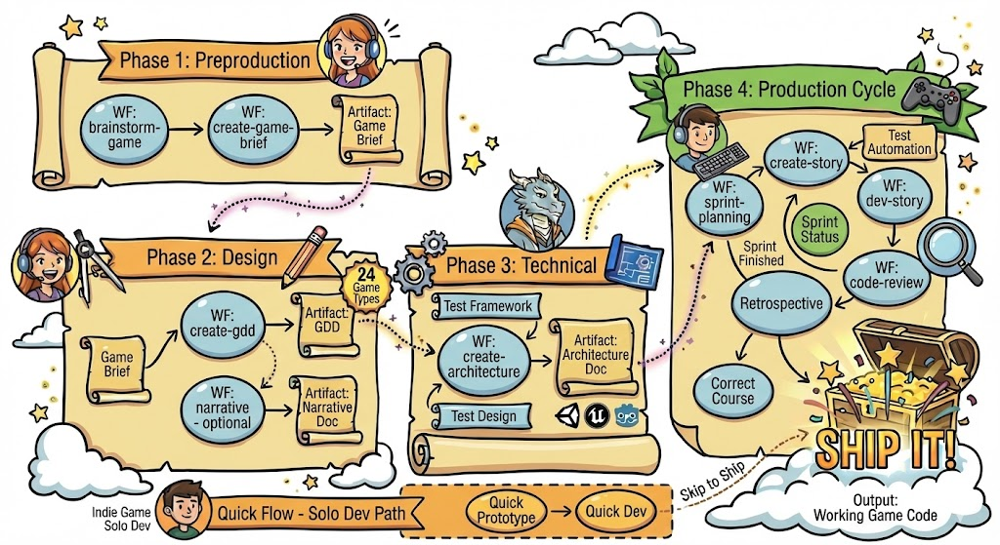

通过人工智能驱动的工作流，使用专业的游戏开发智能体加速游戏开发，引导你完成预制作、设计、架构和实现。

:::note[模块扩展]
BMGD (BMad Game Development) 是 BMad Method 的扩展模块。你需要先安装 BMad - 如果尚未安装，请参阅 [BMad v6 教程](/docs/tutorials/getting-started/getting-started-bmadv6.md)。
:::

## 你将学习到

- 安装和配置 BMGD 模块
- 理解游戏开发阶段和专用智能体
- 创建游戏简报和游戏设计文档 (GDD)
- 从概念到可运行的游戏代码

:::note[先决条件]
- **已安装 BMad Method** - 请先遵循主安装指南
- **游戏创意** - 即使是粗略的概念也足够开始
- **AI 驱动的 IDE** - Claude Code、Cursor、Windsurf 或类似工具
:::

:::tip[快速路径]
**安装** → `npx bmad-method install` (选择 BMGD 模块)
**预制作** → 游戏设计师创建游戏简报
**设计** → 游戏设计师创建 GDD (如果是剧情驱动游戏则创建叙事文档)
**技术** → 游戏架构师创建架构文档
**生产** → 游戏 Scrum Master 管理迭代，游戏开发者实现
**始终为每个工作流使用新的聊天会话**以避免上下文问题。
:::

## 理解 BMGD

BMGD 遵循四个游戏开发阶段，每个阶段都有专用智能体：

| 阶段 | 名称         | 内容描述                                     |
| ---- | ------------ | -------------------------------------------- |
| 1    | 预制作       | 捕捉游戏愿景，创建游戏简报 (可选头脑风暴)     |
| 2    | 设计         | 详细设计机制、系统、叙事 (在 GDD 中)          |
| 3    | 技术         | 规划引擎、架构和技术决策                      |
| 4    | 生产         | 逐个故事在迭代中构建游戏                     |



*完整的流程图展示游戏开发的所有阶段、工作流和智能体。*

### 游戏开发智能体

| 智能体                   | 使用场景                                   |
| ---------------------- | ------------------------------------------ |
| **游戏设计师**         | 头脑风暴、游戏简报、GDD、叙事设计          |
| **游戏架构师**         | 架构设计、技术决策                          |
| **游戏开发者**         | 实现、代码审查                             |
| **游戏 Scrum Master** | 迭代规划、故事管理                         |
| **游戏 QA**            | 测试框架、测试设计、自动化                 |
| **游戏独立开发者**     | 快速原型开发、独立游戏开发                 |

## 安装

如果尚未安装 BMad：

```bash
npx bmad-method install
```

或在现有安装中添加 BMGD：

```bash
npx bmad-method install --add-module bmgd
```

验证安装：

```
your-project/
├── _bmad/
│   ├── bmgd/           # Game development module
│   │   ├── agents/     # Game-specific agents
│   │   ├── workflows/  # Game-specific workflows
│   │   └── config.yaml # Module config
│   ├── bmm/            # Core method module
│   └── core/           # Core utilities
├── _bmad-output/       # Generated artifacts (created later)
└── .claude/            # IDE configuration (if using Claude Code)
```

## 步骤 1：创建游戏简报 (预制作)

在 IDE 中加载 **游戏设计师** 智能体，等待菜单出现，然后从你的游戏概念开始。

### 可选：先进行头脑风暴

如果有模糊的想法并希望得到帮助完善：

```
运行 brainstorm-game
```

智能体会引导你通过特定于游戏的构思技巧来完善概念。

### 创建游戏简报

```
运行 create-game-brief
```

游戏设计师引导你完成：
- **游戏概念** - 核心理念和独特卖点
- **设计支柱** - 指导所有决策的 3-5 项原则
- **目标市场** - 谁玩这款游戏？
- **基础要素** - 平台、类型、范围、团队规模

完成后，你将在 `_bmad-output/` 文件夹中获得 `game-brief.md`。

:::caution[新的聊天会话]
始终为每个工作流开启新的聊天会话。这可以防止上下文限制导致问题。
:::

## 步骤 2：设计游戏

游戏简报完成后，详细设计你的游戏。

### 创建 GDD

在 **游戏设计师** 智能体中**开启新的聊天会话**。

```
运行 create-gdd
```

智能体引导你完成机制、系统和特定游戏类型的部分。BMGD 提供 24 种游戏类型模板，为不同流派提供特定结构。

完成后，你将获得 `gdd.md` (大型文档可能分片存储在 `gdd/` 目录中)。

:::note[叙事设计 (可选)]
对于剧情驱动游戏，开启新的聊天会话并运行 `narrative` 创建叙事设计文档，涵盖故事、角色、世界观和对话。
:::

:::tip[查看状态]
不确定下一步？加载任意智能体并运行 `workflow-status`。它会告诉你推荐的下一个工作流。
:::

## 步骤 3：规划架构

在 **游戏架构师** 智能体中**开启新的聊天会话**。

```
运行 create-architecture
```

架构师引导你完成：
- **引擎选择** - Unity、Unreal、Godot、自定义等
- **系统设计** - 核心游戏系统及其交互方式
- **技术模式** - 适合游戏的架构模式
- **结构** - 项目组织和约定

完成后，你将获得 `game-architecture.md`。

## 步骤 4：构建游戏

规划完成后进入生产阶段。**每个工作流都应开启新的聊天会话。**

### 初始化迭代规划

加载 **游戏 Scrum Master** 智能体并运行 `sprint-planning`。这会创建 `sprint-status.yaml` 跟踪所有史诗和故事。

### 构建周期

为每个故事重复此周期（使用新的聊天会话）：

| 步骤 | 智能体        | 工作流         | 目的                             |
| ---- | ----------- | -------------- | -------------------------------- |
| 1    | Game SM     | `create-story` | 从史诗创建故事文件               |
| 2    | Game Dev    | `dev-story`    | 实现故事                         |
| 3    | Game QA     | `automate`     | 生成测试 (可选)                  |
| 4    | Game Dev    | `code-review`  | 质量验证 (推荐)                 |

完成一个史诗中的所有故事后，加载 **Game SM** 并运行 `retrospective`。

### 快速原型替代方案

用于快速迭代或独立游戏开发，加载 **游戏独立开发者** 智能体：
- `quick-prototype` - 快速原型开发
- `quick-dev` - 无完整迭代结构的灵活开发

## 已完成内容

你已学会使用 BMad 构建游戏的基础：

- 安装了 BMGD 模块
- 创建了捕捉愿景的游戏简报
- 在 GDD 中详细设计了游戏
- 规划了技术架构
- 理解了实现所需的构建周期

你的项目现在包含：

```
your-project/
├── _bmad/                         # BMad configuration
├── _bmad-output/
│   ├── game-brief.md              # Your game vision
│   ├── gdd.md                     # Game Design Document
│   ├── narrative-design.md        # Story design (if applicable)
│   ├── game-architecture.md       # Technical decisions
│   ├── epics/                     # Epic and story files
│   └── sprint-status.yaml         # Sprint tracking
└── ...
```

## 快速参考

| 命令                   | 智能体          | 目的                       |
| ---------------------- | ------------- | -------------------------- |
| `*brainstorm-game`     | 游戏设计师    | 引导式游戏构思             |
| `*create-game-brief`   | 游戏设计师    | 创建游戏简报               |
| `*create-gdd`          | 游戏设计师    | 创建游戏设计文档           |
| `*narrative`           | 游戏设计师    | 创建叙事设计               |
| `*create-architecture` | 游戏架构师    | 创建游戏架构               |
| `*sprint-planning`     | Game SM       | 初始化迭代跟踪             |
| `*create-story`        | Game SM       | 创建故事文件               |
| `*dev-story`           | Game Dev      | 实现故事                   |
| `*code-review`         | Game Dev      | 审查已实现代码             |
| `*workflow-status`     | 任意          | 查看进度和下一步           |

## 常见问题

**需要创建所有文档吗？**
至少需要创建游戏简报和 GDD。架构文档强烈推荐。叙事设计仅适用于剧情驱动游戏。

**可以使用 Game Solo Dev 完成所有工作吗？**
可以，适用于小型项目或快速原型开发。大型游戏则专用智能体提供更全面的指导。

**支持哪些游戏类型？**
BMGD 包含 24 种游戏类型模板 (RPG、平台游戏、解谜、策略等)，提供特定流派的 GDD 部分。

**后期可以修改设计吗？**
可以。文档是动态产物 - 随着愿景演变可返回更新。SM 智能体提供 `correct-course` 用于范围变更。

## 获取帮助

- **工作流期间** - 智能体通过问题和解释引导你
- **社区** - [Discord](https://discord.gg/gk8jAdXWmj) (#bmad-method-help, #report-bugs-and-issues)
- **文档** - [BMGD 工作流参考](/docs/reference/workflows/bmgd-workflows.md)
- **视频教程** - [BMad Code YouTube](https://www.youtube.com/@BMadCode)

## 关键要点

:::tip[记住这些]
- **始终使用新的聊天会话** - 每个工作流在新会话中加载智能体
- **先完成游戏简报** - 它指导后续所有工作
- **使用游戏类型模板** - 24 个模板提供流派特定结构
- **文档是动态的** - 随着愿景发展返回更新
- **Solo Dev 加速开发** - 使用游戏独立开发者进行快速原型开发
:::

准备好了吗？加载 **游戏设计师** 智能体并运行 `create-game-brief` 捕捉你的游戏愿景。

---
## 术语说明

- **BMGD**：BMad Game Development 的缩写，BMad 的游戏开发模块
- **GDD**：Game Design Document 的缩写，游戏设计文档
- **Scrum Master**：敏捷开发中的迭代管理角色
- **Sprint**：敏捷开发中的迭代周期
- **Epic**：大型用户故事集合，通常对应一个功能模块
- **智能体**：能独立运行的程序实体
